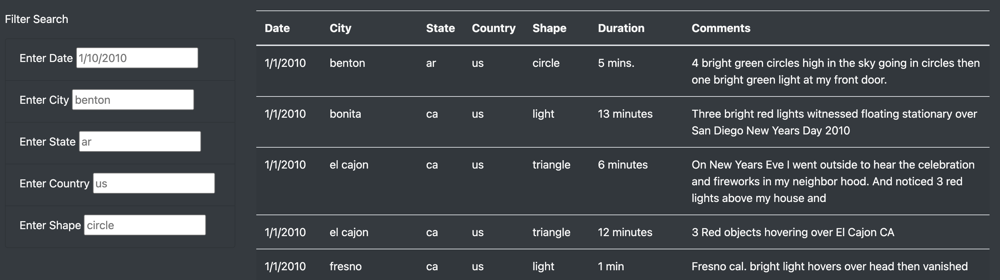
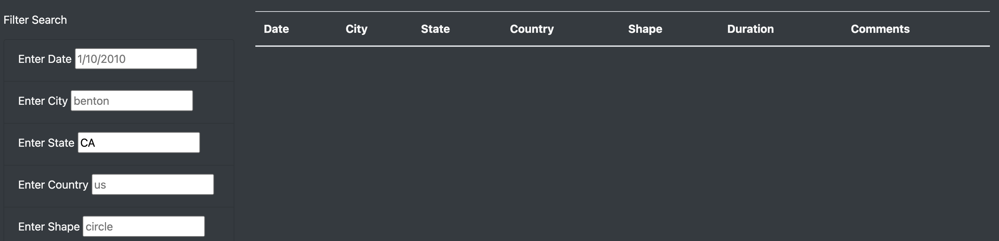

# UFOs

## Overview of Project

In this analysis we created a tool where endusers can review various UFO sitings.  The tool contains a table where the end user can easily filter the data on different variables such as the date of the siting, the location (city, state and country)and the shape of the UFO.

## Results

Using JavaScript and html we created a master table with all of the UFO sitings that would be displayed in a web application.  This application provides the end user with filters that they can enter what they want to see and then the table automatically filters based on the variables that the end user enters.  There are three main files involved in creating this code:
  1) data.js holds all the UFO siting data
  2) app.js contains the code that executes the filters
  3) index.html contains the code to build the website

### The Index File
The ability to offer different filters is created with html code creating a list class.  For example the button to enter a filter on city is created with the following code:
 `<li class="bg-dark list-group-item">
        <!--create label tag "Enter city" for input field-->
        <label for="city">Enter City</label>
        <!--type text means the code will look for text input placeholder sets format for inputters, "datetime" is what the code will look for-->
        <input type="text" placeholder="benton", id=city />`

The Index file also helps organize the page into a user friendly format.

### The app.js File
This file established the code to create and filter the table in the html web application.  Below is a visual of the filters and the table

When a user enters data into one of the boxes the table will filter based on that entry.  This is a result of code that identifies the changed element

`let changedElement = d3.select(this);`
    `let elementValue = changedElement.property("value");`
  `console.log(elementValue);`
   `let filterID = changedElement.attr("id");`
  `console.log(filterID);`
  
  `if (elementValue) {`
    `filters[filterID] = elementValue;`

## Summary
In summary this is a useful tool to review the UFOs sitings data, however, it could use some improvements.  The free form fields could be prone to errors.  I would recommend  adding code to provide drop downs with the options to choose from and correct formatting.  For example, California is in the data, however, if you enter "CA" instead of "ca" the table will filter to no data (see below image).  Another useful addtition to the code would be a button to clear all entries and return to the original table.

